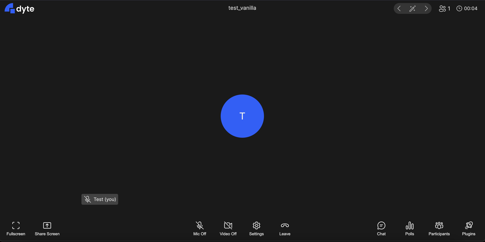
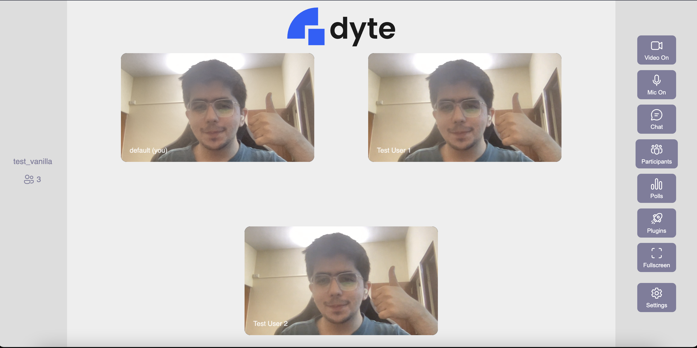

<!-- PROJECT LOGO -->
<p align="center">
  <a href="https://dyte.io">
    
  </a>

  <h3 align="center">Vanilla JS Sample App</h3>

  <p align="center">
    A basic project demonstrating how you can integrate **dyte** in your Vanilla app.
    <br />
    <a href="https://docs.dyte.io"><strong>Explore the docs »</strong></a>
    <br />
    <br />
    <a href="https://github.com/dyte-in/vanilla-js-sample-app/issues">Report Bug</a>
    ·
    <a href="https://github.com/dyte-in/vanilla-js-sample-app/issues">Request Feature</a>
  </p>
</p>

<!-- TABLE OF CONTENTS -->

## Table of Contents

- [About the Project](#about-the-project)
- [Structure](#structure)
- [Application FLow](#application-flow)
- [Getting Started](#getting-started)
  - [Installation](#installation)
- [Usage](#usage)

- [License](#license)

<!-- ABOUT THE PROJECT -->

## About The Project

A basic project with two examples demonstrating how you can integrate **dyte** in your Vanilla JS app.

### Built With

- [dyte-ui-kit](https://www.npmjs.com/package/@dytesdk/ui-kit)
- [dyte-web-core](https://www.npmjs.com/package/@dytesdk/web-core)

<!-- GETTING STARTED -->

## Structure

Vanilla App structure:

```
├── public
│   ├── 📁 dyte-default-config
│   |   ├── 📁 scripts
│   |   |   ├── dyte-init.js
|   |   ├── index.html
│   ├── 📁 dyte-default-config
│   |   ├── 📁 scripts
│   |   |   ├── dyte-init.js
|   |   ├── index.html
|   ├── 📁 scripts
|   |   ├── const.js
|   |   ├── util.js
|   ├── index.html

```

## Getting Started

Please make sure you have created a room on the [Dyte Developer Portal](https://dev.dyte.io/) and have an auth token that connects to that room generated via our backend apis

### Installation

1. Clone the repo

```sh
git clone https://github.com/dyte-in/vanilla-js-sample-app.git
```

3. Update `public/scripts/conts.js` with your roomName and authToken
```js
export const ROOM_NAME=''
export const AUTH_TOKEN=''
```

4. Open `public/index.html` in your browser

5. Install Live Server and run it (optional)

```sh
npm install
npm run start
```


## Application Flow

### `public/index.html`
A simple homepage on `http://localhost:8080/` which navigates you to the two sample apps we have:

### 1. `public/dyte-default-config`
On opening `http://localhost:8080/dyte-default-config/index.html` in your browser, we call `DyteClient.init()` which is exposed to us by importing the dyte web core

```html
<script src="https://cdn.dyte.in/core/dyte.js"/>
```

`DyteClient.init()` returns a dyte meeting object to us which has context on all attributes neccesary for displaying a meeting on our UI

We then define all our dyte components in our app using
```html
<script type="module">
    import { defineCustomElements } from 'https://cdn.jsdelivr.net/npm/@dytesdk/ui-kit/loader/index.es2017.js';
    defineCustomElements();
</script>
```
and just add `<dyte-meeting />` to our web document. 

`<dyte-meeting />` expects the meeting object we defined earlier using `DyteClient.init()` to passed to it as a prop, (Be sure to call `.joinRoom()` on the meeting object to join a meeting first!).

Once the meeting object is passed to dyte-meeting it will automatically rerender with the default dyte ui config!



### 2. `public/dyte-custom-elements`
Similar to dyte-default-config we initialise our meeting, and join our room. But this time we don't simply add `<dyte-meeting>` to our dom. We actually use the [dyte ui-kit elements](https://docs.dyte.io/ui-kit/quickstart) to build a different UI using dyte components!

You can checkout `public/dyte-custom-elements/index.html` to see how each of these elements are used and `public/dyte-custom-elements/scripts/dyte-init.js` to see how we pass the meeting prop to each component and listen for certain events to update our UI.

We end up with a simple meeting with our own custom UI in very few lines of code!



<!-- USAGE EXAMPLES -->

## Usage

Open `localhost:8080/` or `/../dyte-vanilla-sample-app/public/index.html` and choose the sample app you want to see

<!-- You can use this example as a reference on how you can integrate your webapp with dyte. -->

_For documentation on APIs, Web core and ui-kit, please refer to our [official documentation](https://docs.dyte.io)._

<!-- LICENSE -->

## License

Distributed under the MIT License. See [`LICENSE`](./LICENSE) for more information.